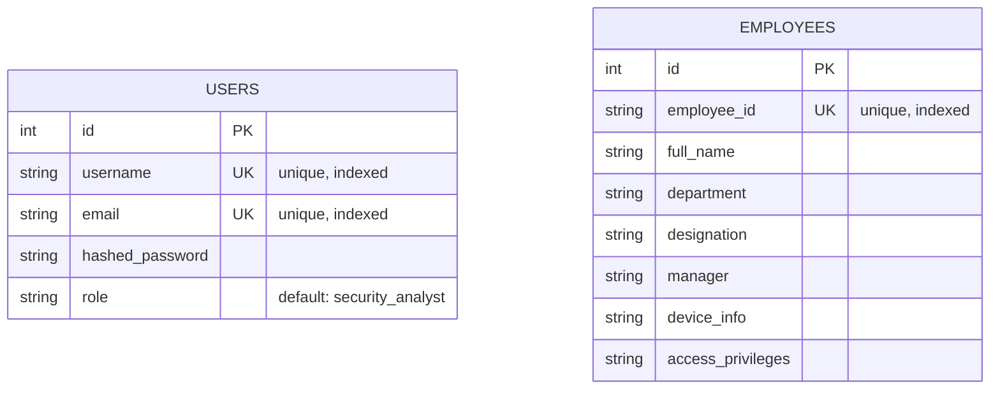

# Database Schema — Insider Threat Behavioral Intelligence System

This document describes the current relational schema, generated from
`backend/app/models.py` (SQLAlchemy ORM models).

## Overview

The system currently uses two core tables in the primary relational database:

- **`users`** — application accounts (analysts, admins, etc.) used for authentication and RBAC
- **`employees`** — monitored organization employees whose behavior is tracked by the platform

These are intentionally separate: a `user` is someone who logs into the platform
(a security analyst, admin, etc.), while an `employee` is a subject of monitoring
(may or may not also have a `user` account).

## Entity-Relationship Diagram

> Note: No foreign key currently links `users` to `employees`. They are
> independent tables. If a future requirement needs to associate a login
> account with a monitored employee record, an `employee_id` foreign key
> should be added to `users` (or a join table, if the relationship can be
> many-to-many).

## Table: `users`

Stores platform login accounts and their assigned role for RBAC enforcement.

| Column | Type | Constraints | Description |
|---|---|---|---|
| `id` | Integer | Primary Key, Indexed | Auto-incrementing user ID |
| `username` | String | Unique, Indexed, Not Null | Login username |
| `email` | String | Unique, Indexed, Not Null | User's email address |
| `hashed_password` | String | Not Null | Bcrypt-hashed password (never stored in plaintext) |
| `role` | String | Default: `"security_analyst"` | RBAC role — expected values: `security_analyst`, `soc_engineer`, `security_manager`, `admin` (per PDF spec; only `security_analyst` and `admin` are currently enforced in code via `require_role()`) |

**Used by:** `/register`, `/login`, `get_current_user()`, `require_role()` in `app/rbac.py`

## Table: `employees`

Stores monitored employee profile data — this is what satisfies the
"Employee Identity & Profile Management" requirement in the PDF spec.

| Column | Type | Constraints | Description |
|---|---|---|---|
| `id` | Integer | Primary Key, Indexed | Auto-incrementing internal ID |
| `employee_id` | String | Unique, Indexed, Not Null | Organization-assigned employee ID (business key) |
| `full_name` | String | Not Null | Employee's full name |
| `department` | String | Nullable | Department name |
| `designation` | String | Nullable | Job title / designation |
| `manager` | String | Nullable | Manager's name (free text — not a FK to `users` or another `employees` row) |
| `device_info` | String | Nullable | Free-text device information |
| `access_privileges` | String | Nullable | Free-text access privilege description |

**Used by:** `POST /employees` (admin/security_manager only), `GET /employees`,
`GET /employees/{employee_id}`, `DELETE /employees/{employee_id}` (admin only)

## Known Gaps vs. PDF Spec

The PDF's "Employee Identity & Profile Management" section also lists
**Asset Association** as a feature. There is currently no `assets` table or
asset-employee relationship — `device_info` is a single free-text field,
not a structured, queryable asset list. This is a gap if asset-level
tracking/reporting is required later.

The **Risk Scoring**, **Anomaly Detection**, and **Incident/UEBA** data
(per `ml/risk_scoring_engine.py`, `ml/predict_api.py`, `investigation_api.py`)
are currently stored as CSV files and a flat JSON file, respectively —
**not** in the relational database. This works for the current scale and
demo purposes but does not persist to PostgreSQL/MongoDB as the PDF's
architecture diagram implies. Migrating these to proper tables
(`anomalies`, `risk_scores`, `incidents`) would be a reasonable next step
if the project needs to scale or if querying/joining this data becomes
necessary.

## Database Engine

Per `app/database.py`, the project currently connects via SQLAlchemy —
confirm the connection string / engine (SQLite for local dev, or PostgreSQL
per the PDF's tech stack) by checking `DATABASE_URL` in your environment
config or `.env` file.
